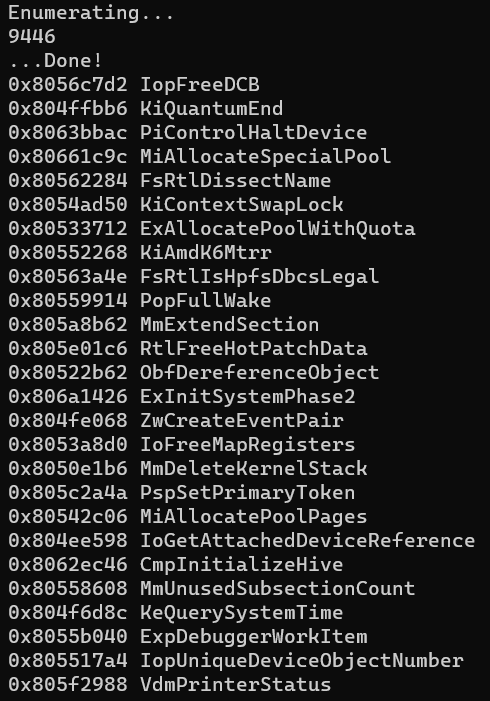
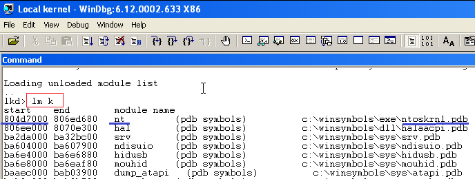

# pdbdump_bochs

Dump PDB Symbols including support for Bochs Debugging Format (with wine support)

If you need download symbol from a file use this project:

- https://github.com/Biswa96/PDBDownloader

Example of use on wine:
```
wine PDBDownloader.exe advapi32.dll
```

## Example with ntkrnlpa loaded in Bochs at 0x804D7000

Download this repo: 

https://github.com/therealdreg/pdbdump_bochs/archive/refs/heads/main.zip

For 32 bit address base:

```
x32\x32_pdbdump_bochs.exe -b ntkrnlpa.pdb:0x804D7000 > sym.txt
```

Check results:
```
type sym.txt
```



Use the generated file in Bochs debugger with ldsym global + file path, example:

```
ldsym global "C:\\Users\\Dreg\\bochs\\sym.txt"
```

Bochs GUI Debugger:


Bochs Console Debugger:


# 64 bit address

**WARNING**: For a 64 bit address you must use x64\x64_pdbdump_bochs.exe
```
x64\x64_pdbdump_bochs.exe -b ntkrnlpa.pdb:0x1122334455667788 > sym_64.txt
```

## Prefix output

```
x32\x32_pdbdump_bochs.exe" -b c:\winsymbols\dll\kernel32.pdb:0x7c800000 PFX:kernel32!
```

```
0x7c801160 kernel32!_imp__NtFindAtom
0x7c825e00 kernel32!c_PmapEntries_apphelp
0x7c863ca4 kernel32!GetThreadTimes
0x7c855154 kernel32!c_PmapEntries_cryptui
0x7c87b813 kernel32!InsertPreComposedForm
0x7c85f578 kernel32!GlobalCompact
0x7c8010e4 kernel32!_imp___allmul
0x7c81736e kernel32!OpenSection
0x7c801164 kernel32!_imp__RtlLookupAtomInAtomTable
0x7c885380 kernel32!gAnsiCodePage
0x7c81cc7b kernel32!GetEnvironmentStrings
0x7c873d1f kernel32!ReadConsoleOutputCharacterW
.....
```

## How to get the base address of a kernel module

Steps:

1. Install WinDBG in guest machine
2. Install Windows Symbols in guest machine
3. Open Windbg and Go to File -> Kernel Debug -> Local
4. Load the symbols: Go to File -> Symbol File Path (and select .reload)
5. Type in Windbg Console (k is for kernel modules): **lm k**



Done, execute pdbdump_bochs.exe using the **lm k** output (pdb file + module base address)

More info:

https://docs.microsoft.com/en-us/windows-hardware/drivers/debugger/setting-up-local-kernel-debugging-of-a-single-computer-manually

## Linux - Debian based

```
apt-get install wine
```

```
WINEDLLOVERRIDES="dbghelp=n;" wine ./x32/x32_pdbdump_bochs.exe -b ntkrnlpa.pdb:0x804D7000
```

For 64 bit address:

```
WINEDLLOVERRIDES="dbghelp=n;" wine ./x64/x64_pdbdump_bochs.exe  -b ntkrnlpa.pdb:0x1122334455667788
```

# HELP - Usage

```
    Usage: pdbdump.exe [-csv] [-sasnf] [-r] pdb_or_exe[:BASE] [PFX:prefix]
       -t: Enumerate types.
     -csv: Output comma-separated-values format.
 -s[asnf]: Sort by (a)ddress, (s)ize, (n)ame, or (f)ile. ASNF to reverse.
       -r: Resolve names and addresses read from stdin.
  -w[...]: Wildcard to use when enumerating symbols.
       -b: Bochs sym output.
   [PFX:]: Prefix each symbol name with own prefix (only valid with -b)

 By default modules (.pdb or .exe files) are loaded with a base address of
 0x400000. This can be overriden by adding a :BASE suffix to the module's
 file name. For example; my_project.pdb:0x20030000.

 Examples: 1. Output all symbols from a.pdb and b.dll;
               > pdbdump_bochs.exe a.pdb b.dll
           2. Output all of a.pdb's function symbols in CSV format;
               > pdbdump_bochs.exe -csv a.pdb | findstr SymTagFunction
           3. List all symbols starting with 'is_enab';
               > pdbdump_bochs.exe -wis_enab* a.pdb
           4. Resolve two symbols by name and by address;
               > echo 0x401000 is_enabled | pdbdump_bochs.exe -r a.pdb
           5. Dump symbols in Bochs Sym format with own base address:
               > pdbdump_bochs.exe -b ntkrnlpa.pdb:0x804D7000
           6. Dump symbols in Bochs Sym format with own base address + nt! prefix:
               > pdbdump_bochs.exe -b ntkrnlpa.pdb:0x804D7000 PFX:nt!
```

# Notes

dbghelp & more from: 
- dbg_amd64_6.12.2.633.msi
- dbg_x86_6.12.2.633.msi

# Related

Helper script for Windows kernel debugging with IDA Pro on native Bochs debugger (including PDB symbols):
- https://github.com/therealdreg/ida_bochs_windows

Helper scripts for windows debugging with symbols for Bochs and IDA Pro (PDB files). Very handy for user mode <--> kernel mode:
- https://github.com/therealdreg/symseghelper

# Credits

This project is just a mod from pdbdump by Martin Ridgers, pdbdump 'at' fireproofgravy.co.uk:

- https://gist.github.com/mridgers/2968595

